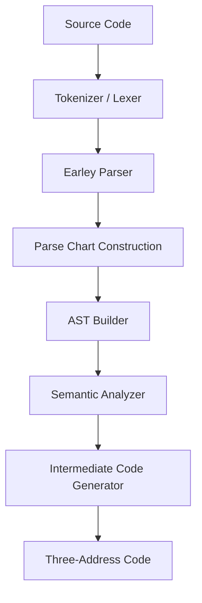
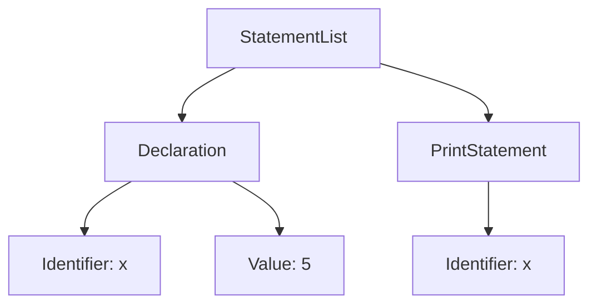

# 🚀 Earley Compiler (C++)

**A High-Performance Compiler Built with Earley Parsing Algorithm in Modern C++**


-orange?style=for-the-badge)

---

## ✨ Overview

**Earley Compiler** is a clean, modular, and extensible compiler implemented in **Modern C++**. It demonstrates a complete compilation pipeline using the powerful **Earley Parsing Algorithm**, known for its ability to handle any context-free grammar efficiently.

This project serves as both an educational tool and a solid foundation for experimental programming language design.

### Key Highlights
- Implemented in **Modern C++20**
- Full compiler pipeline: Lexer → Earley Parser → AST → Semantic Analysis → IR
- High performance and memory efficiency
- Clean architecture with excellent separation of concerns

---

## 📋 Compiler Pipeline



## 📌 Features
* **Fast & Efficient Lexer** written in C++
* **Earley Parser** – Supports ambiguous, left-recursive, and complex grammars
* **Abstract Syntax Tree (AST)** – Well-structured C++ class hierarchy using smart pointers
* **Semantic Analysis** – Symbol table, type checking, and error reporting
* **Three-Address Code (TAC)** generation
* **Modular & Extensible** design

---

## 🧪 Example Dry Run

**Input Program**
```c
int x = 5;
print(x);
```

### STEP 1 — Tokenization
```text
[int] [x] [=] [5] [;] [print] [(] [x] [)] [;]
```

### STEP 2 — Earley Parsing
Dynamic chart construction with states for:
* Declarations
* Assignments & Expressions
* Print statements
* Ready for loops, conditionals, and functions

**Result:** Syntax successfully validated.

### STEP 3 — AST Construction


### STEP 4 — Semantic Analysis
**Checks Performed:**
✅ Variable declaration & usage
✅ Type consistency
✅ No undeclared identifiers

**Symbol Table:**
```text
x → Type: int | Scope: Global
```

### STEP 5 — Intermediate Code Generation
```text
x = 5
print x
```
**✅ Compilation Successful!**

---

## 🛠️ Technologies & Design Choices

| Component | Technology | Reason |
| :--- | :--- | :--- |
| **Language** | C++20 | Performance & Modern Features |
| **Lexer** | Custom Hand-written | Speed & Precision |
| **Parser** | Earley Algorithm | Power & Flexibility |
| **AST** | Smart Pointers + Polymorphism | Clean Object-Oriented Design |
| **Symbol Table** | `std::unordered_map` | Efficiency |
| **IR** | Three-Address Code | Easy to optimize |

**Why Earley Parser?**
* Handles any context-free grammar
* Naturally supports ambiguity and recursion
* Ideal for research and language prototyping

---

## 🚀 Getting Started

### Prerequisites
* CMake 3.16 or higher
* C++20 compatible compiler (GCC 11+, Clang 13+, MSVC 2019+)

### Build Instructions
```bash
git clone https://github.com/Sandheep-S-95/SyntaxForge-Compiler
cd earley-compiler
docker build -t earley-compiler .
docker run --rm earley-compiler
```

---

## 🎯 Roadmap
* [ ] Optimization passes
* [ ] Support for loops, conditionals, and functions
* [ ] Rich validations
* [ ] Intermediate results display

---

## 📜 License
This project is open for educational and research purposes.

*Built using Modern C++* 
*showcasing a complete compiler pipeline with the Earley Parsing Algorithm*