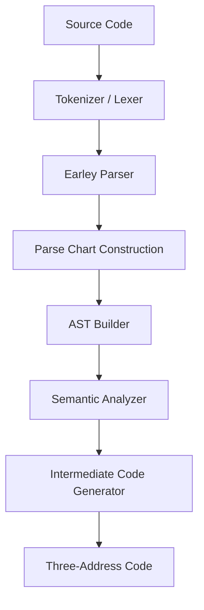

# 🚀 Earley Compiler (SyntaxForge)

**A High-Performance Compiler Built with Earley Parsing Algorithm in Modern C++**

[](https://github.com/Sandheep-S-95/SyntaxForge-Compiler/actions)
[](https://sonarcloud.io/project/overview?id=Sandheep-S-95_SyntaxForge-Compiler)
[](https://github.com/Sandheep-S-95/SyntaxForge-Compiler/security/code-scanning)
[](https://hub.docker.com/r/sandheep95/earley-compiler)


---

## ✨ Overview

**SyntaxForge-Compiler** is a clean, modular, and extensible compiler implemented in **Modern C++**. It demonstrates a complete compilation pipeline using the powerful **Earley Parsing Algorithm**, known for its ability to handle any context-free grammar efficiently (including ambiguous and left-recursive grammars).

This project features a fully automated, enterprise-grade CI/CD pipeline that handles testing, static analysis, security scanning, and multi-stage Docker deployments.

---

## 📊 Live Project Dashboards

Want to see the pipeline in action? Check out the live reports generated by every commit:

* **[⚙️ GitHub Actions CI/CD](https://github.com/Sandheep-S-95/SyntaxForge-Compiler/actions)** - View the automated build, test, and deployment logs.
* **[🛡️ CodeQL Security](https://github.com/Sandheep-S-95/SyntaxForge-Compiler/security/code-scanning)** - View the semantic code analysis and memory safety checks.
* **[📈 SonarCloud Quality Gate](https://sonarcloud.io/project/overview?id=Sandheep-S-95_SyntaxForge-Compiler)** - View code smells, maintainability ratings, and technical debt.
* **[🐳 Docker Hub Registry](https://hub.docker.com/r/sandheep95/earley-compiler)** - Pull the latest optimized Alpine Linux image.

---

## 📋 Compiler Pipeline & Features



### Key Capabilities
* **Custom Lexer**: Fast and efficient tokenization written purely in C++.
* **Earley Parser**: Dynamic parse chart construction supporting complex language grammars.
* **AST Construction**: Well-structured hierarchical tree generation for variable declarations, conditionals, loops, and expressions.
* **Semantic Analysis**: Symbol table generation, strict type checking, and dimension mismatch detection for arrays.
* **Intermediate Representation (IR)**: Generates highly readable Three-Address Code (TAC).

---

## 🛠️ DevOps & CI/CD Architecture

This project strictly adheres to continuous integration best practices. On every push to `main`:

1. **Static Analysis**: Code is sent to SonarCloud to enforce C++ best practices and maintainability.
2. **Security Scanning**: GitHub CodeQL compiles the codebase into a relational database to hunt for memory leaks, buffer overflows, and vulnerabilities.
3. **Automated Testing**: Natively compiles via `g++` and executes `run_tests.sh` against valid and invalid input sets.
4. **Containerization**: If all tests pass, Docker Buildx creates a highly optimized, multi-stage Alpine Linux image (under 10MB) and pushes it to Docker Hub.

---

## 🚀 Getting Started

### Option 1: Run via Docker (Recommended)
You do not need to install C++ or any dependencies to run the compiler. Simply pull the automated image and mount your input file.

1. Create a local file named `input.txt` with your source code:
   ```c
   int x = 5;
   print(x);
   ```
2. Run the compiler container:
   ```bash
   docker run --rm -v "${PWD}/input.txt:/app/input.txt" sandheep95/earley-compiler
   ```

### Option 2: Build Locally from Source
If you want to modify the source code, you can build it natively.

**Prerequisites:** A C++17 compatible compiler (GCC 11+, Clang 13+, MSVC 2019+).

```bash
# Clone the repository
git clone [https://github.com/Sandheep-S-95/SyntaxForge-Compiler.git](https://github.com/Sandheep-S-95/SyntaxForge-Compiler.git)
cd SyntaxForge-Compiler

# Compile the project
g++ compiler.cpp -std=c++17 -o compiler

# Run the compiler
./compiler
```

### Running the Test Suite
To verify the compiler's integrity against the test suite:
* **Linux/Mac (Git Bash):** `./run_tests.sh`
* **Windows (PowerShell):** `.\run_tests.ps1`

---

## 📁 Project Structure

```text
SyntaxForge-Compiler/
├── .github/workflows/   # CI/CD (Build, Test, Push, Sonar) & CodeQL pipelines
├── tests/               # Valid and invalid test cases
├── compiler.cpp         # Main C++ source code (Lexer, Parser, AST, IR)
├── Dockerfile           # Multi-stage Alpine build configuration
├── input.txt            # Live execution environment input
├── run_tests.sh         # Linux testing script
└── run_tests.ps1        # Windows testing script
```

---

## 📜 License
This project is open for educational and research purposes.

*Built with ❤️ using Modern C++ and fully automated CI/CD.*
